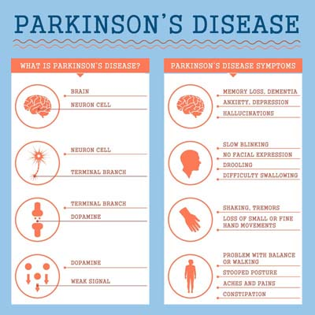

# Parkinson's Disease Prediction

This Capstone Project is the last project of the Azure Machine Learning nanodegree and I'm going to use the Parkison's disease dataset to predict the disease. In this project, two models are created in the following way:
  1. First, Using AutoML model
  2. Then, using a customized model and tuning its hyperparameters with HyperDrive

After these steps are performed, we compare the performance of both models and deploy the best model. 

<hr/>

## TABLE OF CONTENTS
* [Project Set Up and Installation](#project-set-up-and-installation)
* [Projct Architecture](@project-architecture)
* [Dataset](#dataset)
  * [Overview](#overview)
  * [Task](#task)
  * [Access](#access)
* [Automated ML](#automated-ml)
  * [Results](#results)
* [Hyperparameter Tuning](#hyperparameter-tuning)
  * [Results](#results)
* [Model Deployment](#model-deployment)
* [Screen Recording](#screen-recording)
* [Standout Suggestions](standout-suggestions)
* [References](#references)
<hr/>

## Project Set Up and Installation
This project is done using Azure ML lab and a workspace was already provided to us. In order to start we need to do the following:
````
- Set up a compute instance, give it a name such `project-compute` with `STANDARD_DS3_V2` size.
- Create a ML compute cluster with `STANDARD_DS12_V2`, 1 minimun node and 6 maximum number of nodes.
````

## Dataset

### Overview
For this project, I am using the [Parkinson's disease dataset](https://www.kaggle.com/nidaguler/parkinsons-data-set) from Kaggle. 

Parkinson's disease, also referred as PD, is a neurodegenerative disorder that affects predominately dopamine-producing neurons in a specific area of the brain called substantia nigra. The most common motor symptoms are tremors (rhythmic shaking), stiffness, slowness of movement and the non motor symptoms are sleep problems, constipation, axiety, depression, fatigue, etc. In the US, there are around 1 million people who live with Parkinson's disease and around 10 million worldwide. Most people who develop this disease are around age 50 and low cases of younger adults. The exact cause of Parkinson’s is still unknown and there is no cure for it, but there is a lot of research being done to learn more about it. I became interested in learning more about this disease since my dad was diagnosed with it 4 years ago and I want to have a better understanding of the disease. 

<p align="center">
</p>
<p align="center">Figure 1. Parkinson's Disease symptoms</p>

This dataset is composed of a range of biomedical voice measurements from 31 people, 23 with Parkinson's disease (PD). Each column in the table is a particular voice measure, and each row corresponds one of 195 voice recording from these individuals ("name" column). The main aim of the data is to discriminate healthy people from those with PD, according to "status" column which is set to 0 for healthy and 1 for Parkinson's Disease (PD).
````
Attribute information:

Matrix column entries (attributes):
name - ASCII subject name and recording number
MDVP:Fo(Hz) - Average vocal fundamental frequency
MDVP:Fhi(Hz) - Maximum vocal fundamental frequency
MDVP:Flo(Hz) - Minimum vocal fundamental frequency
MDVP:Jitter(%),MDVP:Jitter(Abs),MDVP:RAP,MDVP:PPQ,Jitter:DDP - Several
measures of variation in fundamental frequency
MDVP:Shimmer,MDVP:Shimmer(dB),Shimmer:APQ3,Shimmer:APQ5,MDVP:APQ,Shimmer:DDA - Several measures of variation in amplitude
NHR,HNR - Two measures of ratio of noise to tonal components in the voice
status - Health status of the subject (one) - Parkinson's, (zero) - healthy
RPDE,D2 - Two nonlinear dynamical complexity measures
DFA - Signal fractal scaling exponent
spread1,spread2,PPE - Three nonlinear measures of fundamental frequency variation
````
````
Description of the columns:

MDVP:Fo(Hz) - Average vocal fundamental frequency
MDVP:Fhi(Hz) - Maximum vocal fundamental frequency
MDVP:Flo(Hz) - Minimum vocal fundamental frequency
MDVP:Jitter(%),MDVP:Jitter(Abs),MDVP:RAP,MDVP:PPQ,Jitter:DDP - Several measures of variation in fundamental frequency
MDVP:Shimmer,MDVP:Shimmer(dB),Shimmer:APQ3,Shimmer:APQ5,MDVP:APQ,Shimmer:DDA - Several measures of variation in amplitude
NHR,HNR - Two measures of ratio of noise to tonal components in the voice
RPDE,D2 - Two nonlinear dynamical complexity measures
DFA - Signal fractal scaling exponent
spread1,spread2,PPE - Three nonlinear measures of fundamental frequency variation
status - Health status of the subject (one) - Parkinson's, (zero) - healthy
````
### Task
The goal of this project is to train the model to predict whether these individuals have Parkinson's disease or not.

### Access
I uploaded the .csv file into the repo for easy access. To access on Azure notebooks, we need to download it from an external link.
````
from azureml.data.dataset_factory import TabularDatasetFactory
url_path = "https://raw.githubusercontent.com/cladiabringaseverett/nd00333-capstone/master/starter_file/parkinsons.csv"
ds = TabularDatasetFactory.from_delimited_files(path=url_path)
````

## Automated ML
*TODO*: Give an overview of the `automl` settings and configuration you used for this experiment

### Results
*TODO*: What are the results you got with your automated ML model? What were the parameters of the model? How could you have improved it?

*TODO* Remeber to provide screenshots of the `RunDetails` widget as well as a screenshot of the best model trained with it's parameters.

## Hyperparameter Tuning
*TODO*: What kind of model did you choose for this experiment and why? Give an overview of the types of parameters and their ranges used for the hyperparameter search


### Results
*TODO*: What are the results you got with your model? What were the parameters of the model? How could you have improved it?

*TODO* Remeber to provide screenshots of the `RunDetails` widget as well as a screenshot of the best model trained with it's parameters.

## Model Deployment
*TODO*: Give an overview of the deployed model and instructions on how to query the endpoint with a sample input.

## Screen Recording
*TODO* Provide a link to a screen recording of the project in action. Remember that the screencast should demonstrate:
- A working model
- Demo of the deployed  model
- Demo of a sample request sent to the endpoint and its response

## Standout Suggestions
*TODO (Optional):* This is where you can provide information about any standout suggestions that you have attempted.

## References
'Exploiting Nonlinear Recurrence and Fractal Scaling Properties for Voice Disorder Detection',
Little MA, McSharry PE, Roberts SJ, Costello DAE, Moroz IM.
BioMedical Engineering OnLine 2007, 6:23 (26 June 2007)

Figure 1. Fist Choice Neurology. https://www.fcneurology.net/health-topics/parkinsons-disease/

What is Parkinson's Disease. https://www.apdaparkinson.org/what-is-parkinsons/


