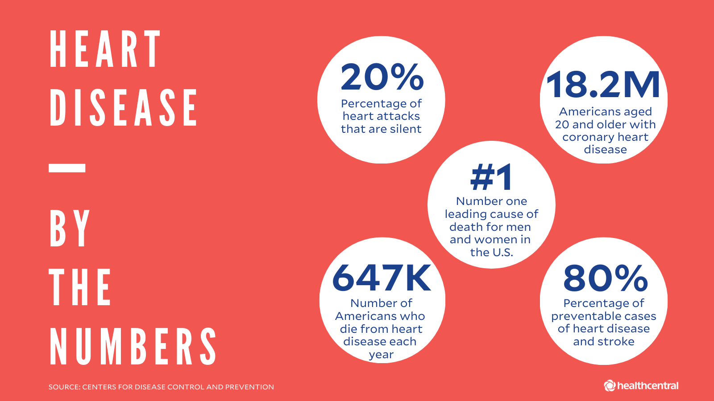

# Heart Failure Prediction

This Capstone Project is the last project of the Azure Machine Learning nanodegree and I'm going to use the Heart Disease dataset to predict the disease. In this project, two models are created in the following way:
  1. First, Using AutoML model
  2. Then, using a customized model and tuning its hyperparameters with HyperDrive

After these steps are performed, we compare the performance of both models and deploy the best model. 

<hr/>

## TABLE OF CONTENTS
* [Project Set Up and Installation](#project-set-up-and-installation)
* [Projct Architecture](@project-architecture)
* [Dataset](#dataset)
  * [Overview](#overview)
  * [Task](#task)
  * [Access](#access)
* [Automated ML](#automated-ml)
  * [Results](#results)
* [Hyperparameter Tuning](#hyperparameter-tuning)
  * [Results](#results)
* [Model Deployment](#model-deployment)
* [Screen Recording](#screen-recording)
* [Standout Suggestions](standout-suggestions)
* [References](#references)
<hr/>

## Project Set Up and Installation
This project is done using Azure ML lab and a workspace was already provided to us. In order to start we need to do the following:
````
- Set up a compute instance, give it a name such `project-compute` with `STANDARD_DS2_V2` size.
- Create a ML compute cluster with `STANDARD_DS12_V2`, 1 minimun node and 6 maximum number of nodes.
````

## Dataset

### Overview
For this project, I am using the [Heart disease dataset](https://www.kaggle.com/andrewmvd/heart-failure-clinical-data) from Kaggle. The term “heart disease” refers to several types of heart conditions. The most common type of heart disease in the United States is coronary artery disease (CAD), which affects the blood flow to the heart. Decreased blood flow can cause a heart attack. Sometimes heart disease may be “silent” and not diagnosed until a person experiences signs or symptoms of a heart attack, heart failure, or an arrhythmia. When these events happen, symptoms may include:

**Heart attack**: Chest pain or discomfort, upper back or neck pain, indigestion, heartburn, nausea or vomiting, extreme fatigue, upper body discomfort, dizziness, and shortness of breath.<br />
**Arrhythmia**: Fluttering feelings in the chest (palpitations).<br />
**Heart failure**: Shortness of breath, fatigue, or swelling of the feet, ankles, legs, abdomen, or neck veins.<br />

What are the risk factors for heart disease?
High blood pressure, high blood cholesterol, and smoking are key risk factors for heart disease. About half of Americans (47%) have at least one of these three risk factors. Several other medical conditions and lifestyle choices can also put people at a higher risk for heart disease, including:

- Diabetes
- Overweight and obesity
- Unhealthy diet
- Physical inactivity
- Excessive alcohol use

<p align="center">
</p>
<p align="center">Figure 1. Heart Disease Information</p>


Cardiovascular diseases (CVDs) are the number 1 cause of death globally, taking an estimated 17.9 million lives each year, which accounts for 31% of all deaths worlwide. Heart failure is a common event caused by CVDs and this dataset contains 12 features that can be used to predict mortality by heart failure. Most cardiovascular diseases can be prevented by addressing behavioural risk factors such as tobacco use, unhealthy diet and obesity, physical inactivity and harmful use of alcohol using population-wide strategies.

People with cardiovascular disease or who are at high cardiovascular risk (due to the presence of one or more risk factors such as hypertension, diabetes, hyperlipidaemia or already established disease) need early detection and management wherein a machine learning model can be of great help.
````
Attribute information:

age - Age of the patient
anemia - Decrease of red blood cells or hemoglobin (boolean)
creatinine_phosphokinase - Level of the CPK enzyme in the blood (mcg/L)
diabetes - If the patient has diabetes (boolean)
ejection_fraction - Percentage of blood leaving the heart at each contraction (percentage)
high_blood_pressure - If the patient has hypertension (boolean)
platelets - Platelets in the blood (kiloplatelets/mL)
serum_creatinine - Level of serum creatinine in the blood (mg/dL)
serum_sodium - Level of serum sodium in the blood (mEq/L)
sex - Woman or man (binary)
smoking - If the patient smokes or not (boolean)
time - Follow-up period (days)
DEATH_EVENT - If the patient deceased during the follow-up period (boolean)
````

### Task
The goal of this project is to train the model to predict mortality caused by heart disease. (death=1, no death=0)
### Access
The dataset can be accessed by loading a csv file in the azure platform


## Automated ML
*TODO*: Give an overview of the `automl` settings and configuration you used for this experiment

### Results
*TODO*: What are the results you got with your automated ML model? What were the parameters of the model? How could you have improved it?

*TODO* Remeber to provide screenshots of the `RunDetails` widget as well as a screenshot of the best model trained with it's parameters.

## Hyperparameter Tuning
*TODO*: What kind of model did you choose for this experiment and why? Give an overview of the types of parameters and their ranges used for the hyperparameter search


### Results
*TODO*: What are the results you got with your model? What were the parameters of the model? How could you have improved it?

*TODO* Remeber to provide screenshots of the `RunDetails` widget as well as a screenshot of the best model trained with it's parameters.

## Model Deployment
*TODO*: Give an overview of the deployed model and instructions on how to query the endpoint with a sample input.

## Screen Recording
*TODO* Provide a link to a screen recording of the project in action. Remember that the screencast should demonstrate:
- A working model
- Demo of the deployed  model
- Demo of a sample request sent to the endpoint and its response

## Standout Suggestions
*TODO (Optional):* This is where you can provide information about any standout suggestions that you have attempted.

## References
Centers for Disease Control and Prevention. Underlying Cause of Death, 1999–2018. CDC WONDER Online Database. Atlanta, GA: Centers for Disease Control and Prevention; 2018. Accessed March 12, 2020.

Virani SS, Alonso A, Benjamin EJ, Bittencourt MS, Callaway CW, Carson AP, et al. Heart disease and stroke statistics—2020 update: a report from the American Heart Associationexternal icon. Circulation. 2020;141(9):e139–e596.

Davide Chicco, Giuseppe Jurman: Machine learning can predict survival of patients with heart failure from serum creatinine and ejection fraction alone. BMC Medical Informatics and Decision Making 20, 16 (2020) https://bmcmedinformdecismak.biomedcentral.com/articles/10.1186/s12911-020-1023-5

Figure 1. Fist Choice Neurology. https://www.healthcentral.com/condition/heart-disease


