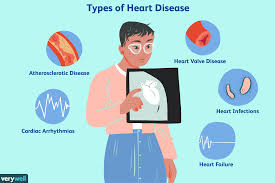

# Heart Failure Prediction

This Capstone Project is the last project of the Azure Machine Learning nanodegree and I'm going to use the Heart Disease dataset to predict the disease. In this project, two models are created in the following way:
  1. First, Using AutoML model
  2. Then, using a customized model and tuning its hyperparameters with HyperDrive

After these steps are performed, we compare the performance of both models and deploy the best model. 

<hr/>

## TABLE OF CONTENTS
* [Project Set Up and Installation](#project-set-up-and-installation)
* [Projct Architecture](@project-architecture)
* [Dataset](#dataset)
  * [Overview](#overview)
  * [Task](#task)
  * [Access](#access)
* [Automated ML](#automated-ml)
  * [Results](#results)
* [Hyperparameter Tuning](#hyperparameter-tuning)
  * [Results](#results)
* [Model Deployment](#model-deployment)
* [Screen Recording](#screen-recording)
* [Standout Suggestions](standout-suggestions)
* [References](#references)
<hr/>

## Project Set Up and Installation
This project is done using Azure ML lab and a workspace was already provided to us. In order to start we need to do the following:
````
- Set up a compute instance, give it a name such `project-compute` with `STANDARD_DS3_V2` size.
- Create a ML compute cluster with `STANDARD_DS12_V2`, 1 minimun node and 6 maximum number of nodes.
````

## Dataset

### Overview
For this project, I am using the [Heart disease dataset](https://www.kaggle.com/ronitf/heart-disease-uci) from Kaggle. 

The term “heart disease” refers to several types of heart conditions. The most common type of heart disease in the United States is coronary artery disease (CAD), which affects the blood flow to the heart. Decreased blood flow can cause a heart attack. Sometimes heart disease may be “silent” and not diagnosed until a person experiences signs or symptoms of a heart attack, heart failure, or an arrhythmia. When these events happen, symptoms may include:

**Heart attack**: Chest pain or discomfort, upper back or neck pain, indigestion, heartburn, nausea or vomiting, extreme fatigue, upper body discomfort, dizziness, and shortness of breath.<br />
**Arrhythmia**: Fluttering feelings in the chest (palpitations).<br />
**Heart failure**: Shortness of breath, fatigue, or swelling of the feet, ankles, legs, abdomen, or neck veins.<br />

<p align="center">
</p>
<p align="center">Figure 1. Types of Heart Disease</p>

This dataset is composed of a range of biomedical voice measurements from 31 people, 23 with Parkinson's disease (PD). Each column in the table is a particular voice measure, and each row corresponds one of 195 voice recording from these individuals ("name" column). The main aim of the data is to discriminate healthy people from those with PD, according to "status" column which is set to 0 for healthy and 1 for Parkinson's Disease (PD).
````
Attribute information:

1) name - object
2) MDVP:Fo(Hz) - float64
3) MDVP:Fhi(Hz) - float64
4) MDVP:Flo(Hz) - float64
5) MDVP:Jitter(%) - float64
6) MDVP:Jitter(Abs) - float64
7) MDVP:RAP - float64
8) MDVP:PPQ - float64
9) Jitter:DDP - float64
10) MDVP:Shimmer - float64
11) MDVP:Shimmer(dB) - float64
12) Shimmer:APQ3 - float64
13) Shimmer:APQ5 - float64
14) MDVP:APQ - float64
15) Shimmer:DDA - float64
16) NHR - float64
17) HNR - float64
18) status - int64
19) RPDE - float64
20) DFA - float64
21) spread1 - float64
22) spread2 - float64
23) D2 - float64
24) PPE - float64
````
````
Description of the columns:

MDVP:Fo(Hz) - Average vocal fundamental frequency
MDVP:Fhi(Hz) - Maximum vocal fundamental frequency
MDVP:Flo(Hz) - Minimum vocal fundamental frequency
MDVP:Jitter(%),MDVP:Jitter(Abs),MDVP:RAP,MDVP:PPQ,Jitter:DDP - Several measures of variation in fundamental frequency
MDVP:Shimmer,MDVP:Shimmer(dB),Shimmer:APQ3,Shimmer:APQ5,MDVP:APQ,Shimmer:DDA - Several measures of variation in amplitude
NHR,HNR - Two measures of ratio of noise to tonal components in the voice
RPDE,D2 - Two nonlinear dynamical complexity measures
DFA - Signal fractal scaling exponent
spread1,spread2,PPE - Three nonlinear measures of fundamental frequency variation
status - Health status of the subject (one) - Parkinson's, (zero) - healthy
````
### Task
The goal of this project is to train the model to predict whether these individuals have Parkinson's disease or not.

### Access
I uploaded the .csv file into the repo for easy access. To access on Azure notebooks, we need to download it from an external link.
````
from azureml.data.dataset_factory import TabularDatasetFactory
dataset_path = "https://raw.githubusercontent.com/claudiabringaseverett/nd00333-capstone/master/starter_file/parkinsons.csv"
ds = TabularDatasetFactory.from_delimited_files(path = dataset_path)
````

## Automated ML
*TODO*: Give an overview of the `automl` settings and configuration you used for this experiment

### Results
*TODO*: What are the results you got with your automated ML model? What were the parameters of the model? How could you have improved it?

*TODO* Remeber to provide screenshots of the `RunDetails` widget as well as a screenshot of the best model trained with it's parameters.

## Hyperparameter Tuning
*TODO*: What kind of model did you choose for this experiment and why? Give an overview of the types of parameters and their ranges used for the hyperparameter search


### Results
*TODO*: What are the results you got with your model? What were the parameters of the model? How could you have improved it?

*TODO* Remeber to provide screenshots of the `RunDetails` widget as well as a screenshot of the best model trained with it's parameters.

## Model Deployment
*TODO*: Give an overview of the deployed model and instructions on how to query the endpoint with a sample input.

## Screen Recording
*TODO* Provide a link to a screen recording of the project in action. Remember that the screencast should demonstrate:
- A working model
- Demo of the deployed  model
- Demo of a sample request sent to the endpoint and its response

## Standout Suggestions
*TODO (Optional):* This is where you can provide information about any standout suggestions that you have attempted.

## References
Centers for Disease Control and Prevention. Underlying Cause of Death, 1999–2018. CDC WONDER Online Database. Atlanta, GA: Centers for Disease Control and Prevention; 2018. Accessed March 12, 2020.

Virani SS, Alonso A, Benjamin EJ, Bittencourt MS, Callaway CW, Carson AP, et al. Heart disease and stroke statistics—2020 update: a report from the American Heart Associationexternal icon. Circulation. 2020;141(9):e139–e596.

Figure 1. Fist Choice Neurology. https://www.verywellhealth.com/heart-disease-treatments-overview-1745923


